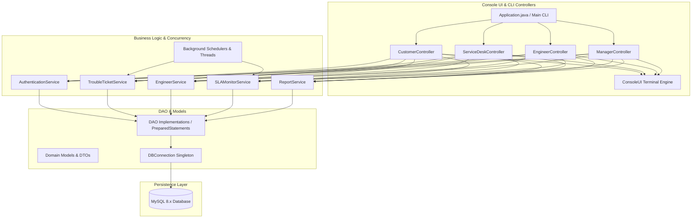
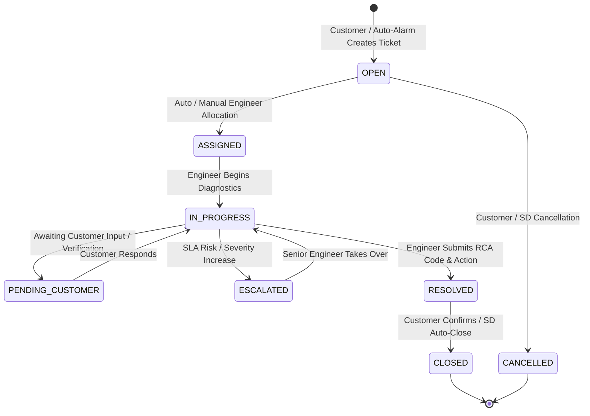

# 📡 Telecom Service Assurance & Trouble Ticket Management System (TSATMS)

[](https://adoptium.net/)
[](https://maven.apache.org/)
[](https://www.mysql.com/)
[](#system-architecture)
[](#)

An enterprise-grade, multi-threaded **Telecom Service Assurance & Trouble Ticket Management System** designed for high-availability Network Operations Centers (NOC), Service Desks, Field Engineers, and Telecom Subscribers. 

Built in pure **Java 8 (with Streams, Lambdas, Concurrency)**, **Raw JDBC**, and **MySQL**, adhering strictly to clean 3-tier enterprise architecture and core GoF design patterns.

---

## 📑 Table of Contents
- [Executive Overview](#-executive-overview)
- [System Architecture & Design Patterns](#-system-architecture--design-patterns)
- [Trouble Ticket Lifecycle](#-trouble-ticket-lifecycle)
- [Role-Based Feature Matrix](#-role-based-feature-matrix)
- [SLA Matrix & Escalation Engine](#-sla-matrix--escalation-engine)
- [Database Design](#-database-design)
- [Quick Start & Setup Guide](#-quick-start--setup-guide)
- [Demo Login Credentials](#-demo-login-credentials)
- [Project Directory Structure](#-project-directory-structure)
- [Case Study Compliance Matrix](#-case-study-compliance-matrix)

---

## 🌟 Executive Overview

In large telecom networks, rapid incident resolution, SLA compliance, and transparent customer communication are critical. **TSATMS** delivers an automated, unified console platform that manages the entire lifecycle of network and service disruptions:

* **Automated Alarm Processing**: Concurrent background workers simulate and ingest network alarms into prioritized trouble tickets.
* **Intelligent Engineer Dispatch**: Rule-based assignment engine allocating incidents by engineer specialization, geography, and active workload balance.
* **Proactive SLA Monitoring**: Multi-threaded scheduler alerting operators before SLA breaches and triggering automated tiered escalations.
* **360° Audit Trail**: Full historical tracking for ticket statuses, engineer assignments, and customer feedback.

---

## 🏛 System Architecture & Design Patterns

The project strictly follows a decoupled **3-Tier Enterprise Architecture**:



### Key Design Patterns Implemented

| Pattern | Class / Component | Description |
| :--- | :--- | :--- |
| **Singleton** | `DBConnection.java` | Thread-safe, synchronized single instance managing database connections. |
| **DAO Pattern** | `*DAO` / `*DAOImpl` | Complete separation of SQL persistence operations from core business logic. |
| **Factory / Strategy** | `ResolutionCode`, `Priority`, `TicketCategory` | Encapsulated domain enumerations and algorithm selection for SLAs & routing. |
| **Observer** | `NotificationDAOImpl` / `NotificationService` | Proactively pushes lifecycle event notifications to customers, engineers, and managers. |
| **Producer-Consumer** | `NetworkEventProcessor.java` | Background worker queue ingesting and triaging simulated telecom network alarms. |

---

## 🔄 Trouble Ticket Lifecycle



---

## 👥 Role-Based Feature Matrix

TSATMS provides tailored workbench dashboards across 4 organizational roles:

### 1. 👤 Telecom Customer Portal
* **Subscribed Services**: View active lines (Broadband, 5G Postpaid, Enterprise VPN, Cloud Links).
* **Raise Incident**: Interactive ticket creation with automatic SLA target computation.
* **Track Status**: Live countdown timer, engineer details, and resolution updates.
* **Audit History**: View time-stamped status change history.
* **Rate Experience**: Submit 1–5 star rating with feedback upon ticket resolution.

### 2. 🎧 Service Desk Operations Console
* **Queue Triage**: View real-time open and unassigned trouble tickets.
* **Dispatch Engine**: Automated engineer allocation using workload balancing or manual assignment override.
* **Ticket Reassignment & Priority Override**: Adjust severity dynamically based on incident scope.
* **Management Escalations**: Escalate high-impact incidents across 4 hierarchy levels (Tier 1 $\rightarrow$ Team Lead $\rightarrow$ Technical Expert $\rightarrow$ Operations Manager).

### 3. 🛠 Network Engineer Workbench
* **Assigned Queue**: View personal ticket queue prioritized by SLA urgency.
* **Diagnostics & Status**: Transition tickets from `ASSIGNED` $\rightarrow$ `IN_PROGRESS` $\rightarrow$ `RESOLVED`.
* **RCA Classification**: Submit root cause analysis with Case Study standard codes (`HARDWARE_FAILURE`, `CONFIGURATION_ERROR`, `NETWORK_CONGESTION`, `SOFTWARE_FAILURE`, `FIBER_CUT`, `POWER_FAILURE`).
* **Live SLA Countdown**: Real-time monitor flagging overdue tickets and warnings (<30m to breach).

### 4. 📊 Network Operations Manager Dashboard
* **Executive Metrics**: Instant view of open incidents, critical outages, and MTTR (Mean Time to Resolve).
* **Engineer Performance Matrix**: Workload distribution, resolved counts, and efficiency ratings.
* **SLA Compliance Analytics**: Real-time compliance percentages per service category.
* **Escalation Queue Management**: Oversee and resolve escalated high-severity incidents.

---

## ⏱ SLA Matrix & Escalation Engine

SLA rules are computed dynamically based on priority levels:

| Priority | Response SLA | Resolution SLA | Auto-Escalation Threshold |
| :--- | :--- | :--- | :--- |
| 🔴 **CRITICAL** | 15 Minutes | **2 Hours** | Warning at 75% elapsed (90 mins) |
| 🟠 **HIGH** | 30 Minutes | **4 Hours** | Warning at 75% elapsed (3 hours) |
| 🟡 **MEDIUM** | 2 Hours | **12 Hours** | Warning at 80% elapsed (9.6 hours) |
| 🟢 **LOW** | 8 Hours | **48 Hours** | Warning at 85% elapsed (40.8 hours) |

---

## 🗄 Database Design

The relational database (`tsatms_db`) is fully normalized (3NF) with primary keys, foreign key constraints, indexes, and analytical views:

```
tsatms_db
├── Tables
│   ├── customer               (Customer demographics, type, and status)
│   ├── telecom_service        (Services subscribed per customer)
│   ├── network_engineer       (Engineer specialization, region, workload)
│   ├── user_account           (Role-based login credentials & password hashes)
│   ├── trouble_ticket         (Core tickets, SLAs, resolution data, and RCA)
│   ├── ticket_status_history  (Full audit trail of state changes)
│   ├── escalation_history     (Escalation paths, reasons, and timestamps)
│   ├── sla_configuration      (Configurable response/resolution targets)
│   ├── network_event          (Incoming network telemetry and alarms)
│   ├── notification           (Event-driven alerts for users)
│   ├── feedback               (Post-resolution customer ratings)
│   ├── login_history          (Security and session audit logs)
│   └── audit_log              (System security and administrative audit)
└── Analytical Views
    ├── vw_open_tickets        (Unresolved ticket queue)
    ├── vw_engineer_workload   (Active ticket capacity per engineer)
    ├── vw_sla_compliance      (Category-level compliance analytics)
    └── vw_incident_analysis   (Resolution time distribution & RCA breakdown)
```

---

## 🚀 Quick Start & Setup Guide

### Prerequisites
* **Java**: OpenJDK 8 or Java 17+ installed
* **Maven**: Apache Maven 3.8+
* **MySQL Server**: 8.0+ running locally on port `3306`

### 1. Database Initialization
Execute the SQL scripts in your MySQL client (Command Line, Workbench, or DBeaver):

```sql
-- 1. Create Schema and Views
SOURCE database/schema.sql;

-- 2. Insert Seed Data
SOURCE database/seed_data.sql;
```

> **Database Configuration**:
> If your MySQL root password is not `RevNor`, update [`DBConnection.java`](file:///src/main/java/com/amdocs/telecom/util/DBConnection.java#L21) with your local password.

---

### 2. Build the Application

Build the executable fat JAR with Maven:

```bash
mvn clean package -DskipTests
```

---

### 3. Run the Application

#### Option A: One-Click Launcher (Windows)
In PowerShell or Command Prompt:
```powershell
.\run.bat
```

#### Option B: Run with Java JAR
```bash
java -jar target/telecom-tsatms-1.0.0-jar-with-dependencies.jar
```

#### Option C: Run via Maven Plugin
```bash
mvn exec:java -Dexec.mainClass="com.amdocs.telecom.main.Application"
```

---

## 🔑 Demo Login Credentials

All demo user accounts are pre-configured with the default password: **`password123`**  
*(A simulated 6-digit 2FA OTP will be displayed on the console screen upon login).*

| Role | Username | Password | Purpose / Focus |
| :--- | :--- | :--- | :--- |
| **Telecom Customer** | `cust100245` | `password123` | Raise tickets, view subscribed lines, track history |
| **Service Desk Admin** | `admin_sd1` | `password123` | Engineer assignment, ticket triage, escalations |
| **Network Engineer** | `eng1008` | `password123` | Work on tickets, submit RCA codes & resolution |
| **Network Manager** | `manager_nm1` | `password123` | View executive dashboards, SLA & incident reports |

---

## 📁 Project Directory Structure

```
amdocs-telecom-tsatms/
├── database/
│   ├── schema.sql                 # Complete MySQL schema DDL & analytical views
│   ├── seed_data.sql              # Realistic seed data (users, services, tickets)
│   └── init_root.sql              # Root user & permission helper script
├── docs/
│   ├── QUICK_START.md             # Concise quick start guide
│   ├── SYSTEM_USER_MANUAL.md      # Comprehensive operational user manual
│   └── Amdocs PreBoarding...pdf   # Official case study specifications
├── scripts/
│   ├── build.bat                  # Automated Maven build script
│   └── run.bat                    # Terminal application launcher
├── src/main/java/com/amdocs/telecom/
│   ├── controller/                # Role-based presentation controllers
│   │   ├── CustomerController.java
│   │   ├── ServiceDeskController.java
│   │   ├── EngineerController.java
│   │   └── ManagerController.java
│   ├── dao/                       # Data Access Object interfaces
│   │   └── impl/                  # JDBC implementations with PreparedStatements
│   ├── dto/                       # Data Transfer Objects for reports & audits
│   ├── exception/                 # Custom domain exception hierarchy
│   ├── main/                      # Application bootstrap entry point
│   ├── model/                     # Domain entity classes
│   │   └── enums/                 # Strongly-typed enumerations
│   ├── scheduler/                 # Background threads (SLA Monitor, Alarms)
│   ├── service/                   # Business logic interfaces
│   │   └── impl/                  # Service implementations & business validation
│   └── util/                      # ConsoleUI design system & DBConnection singleton
├── pom.xml                        # Maven project configuration and dependencies
├── run.bat                        # Root one-click Windows execution batch script
└── README.md                      # Primary project documentation
```

---

## ✅ Case Study Compliance Matrix

| Case Study Requirement | Implementation Detail | Status |
| :--- | :--- | :---: |
| **Multi-Role Console UI** | 4 independent interactive CLI dashboards for Customer, Service Desk, Engineer, Manager | Completed |
| **2FA Authentication & Security** | Password verification + OTP validation + account lock after 3 failed attempts | Completed |
| **Auto-Assignment Engine** | Workload & skill-based allocation algorithm implemented using Java Streams & Lambdas | Completed |
| **SLA Tracking & Real-Time Alerts** | Dynamic target computation with live countdown monitor and overdue breach flags | Completed |
| **4-Tier Escalation Hierarchy** | Complete escalation path management with supervisor notification alerts | Completed |
| **Full Audit Trail** | Every status change, assignment, and escalation recorded in timestamped history tables | Completed |
| **Root Cause (RCA) Classification** | Mandatory 6-tier RCA resolution codes on ticket completion | Completed |
| **Operational & Analytical Reports** | Live compliance metrics, engineer performance matrix, and exportable incident reports | Completed |
| **Clean 3-Tier Architecture** | Strict separation: Controller $\rightarrow$ Service $\rightarrow$ DAO $\rightarrow$ MySQL Database | Completed |

---
**Developed for Amdocs Pre-Boarding Program | TSATMS Capstone Project**
